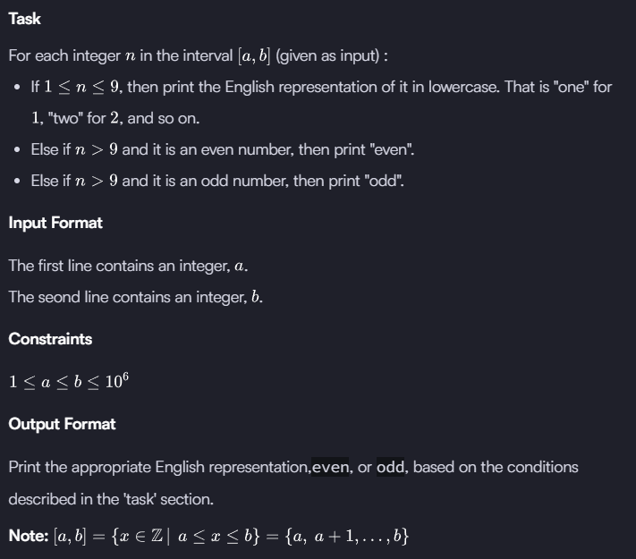

# Numpy

## Arrays

<figure><figcaption></figcaption></figure>

### Using reversed()

```python
import numpy

def arrays(arr):
    return numpy.array(list(reversed(arr)), float)

arr = input().strip().split(' ')
result = arrays(arr)
print(result)
```

### Using numpy.flipud()

```python
import numpy

def arrays(arr):
    return numpy.flipud(numpy.array(arr, float))

arr = input().strip().split(' ')
result = arrays(arr)
print(result)
```

***

## Shape and Reshape

### Shape

The _shape_ tool gives a tuple of array dimensions and can be used to change the dimensions of an array.

**(a). Using **_**shape**_** to get array dimensions**

```python
import numpy

my__1D_array = numpy.array([1, 2, 3, 4, 5])
print my_1D_array.shape     #(5,) -> 1 row and 5 columns

my__2D_array = numpy.array([[1, 2],[3, 4],[6,5]])
print my_2D_array.shape     #(3, 2) -> 3 rows and 2 columns 
```

**(b). Using **_**shape**_** to change array dimensions**

```python
import numpy

change_array = numpy.array([1,2,3,4,5,6])
change_array.shape = (3, 2)
print change_array      

#Output
[[1 2]
[3 4]
[5 6]]
```

### Reshape

The _reshape_ tool gives a new shape to an array without changing its data. It creates a new array and does not modify the original array itself.

```python
import numpy

my_array = numpy.array([1,2,3,4,5,6])
print numpy.reshape(my_array,(3,2))

#Output
[[1 2]
[3 4]
[5 6]]
```

### Task

<figure><figcaption></figcaption></figure>

```python
import numpy

print(numpy.reshape(numpy.array(list(map(int, input().split()))), (3, 3)))
```

***

## Transpose and Flatten

### Transpose

We can generate the transposition of an array using the tool `numpy.transpose`.\
It will not affect the original array, but it will create a new array.

```python
import numpy

my_array = numpy.array([[1,2,3],
                        [4,5,6]])
print numpy.transpose(my_array)

#Output
[[1 4]
 [2 5]
 [3 6]]
```

### Flatten

The tool _flatten_ creates a copy of the input array flattened to one dimension.

```python
import numpy

my_array = numpy.array([[1,2,3],
                        [4,5,6]])
print my_array.flatten()

#Output
[1 2 3 4 5 6]
```

### Task

<figure><figcaption></figcaption></figure>

```python
import numpy

n, m = map(int, input().split())
array = numpy.array([list(map(int, input().split())) for _ in range(n)])

print(numpy.transpose(array))
print(array.flatten())
```

***

## Concatenate

Two or more arrays can be concatenated together using the _concatenate_ function with a tuple of the arrays to be joined:

```python
import numpy

array_1 = numpy.array([1,2,3])
array_2 = numpy.array([4,5,6])
array_3 = numpy.array([7,8,9])

print numpy.concatenate((array_1, array_2, array_3))    

#Output
[1 2 3 4 5 6 7 8 9]
```

If an array has more than one dimension, it is possible to specify the axis along which multiple arrays are concatenated. By default, it is along the first dimension.

```python
import numpy

array_1 = numpy.array([[1,2,3],[0,0,0]])
array_2 = numpy.array([[0,0,0],[7,8,9]])

print numpy.concatenate((array_1, array_2), axis = 1)   

#Output
[[1 2 3 0 0 0]
 [0 0 0 7 8 9]]    
```

### Task

<figure><figcaption></figcaption></figure>

```python
import numpy

n, m, p = map(int, input().split())
arr_n = numpy.array([list(map(int, input().split())) for _ in range(n)])
arr_m = numpy.array([list(map(int, input().split())) for _ in range(m)])

print(numpy.concatenate((arr_n, arr_m)))
```

***

## Zeroes and Ones

### [**zeros**](http://docs.scipy.org/doc/numpy/reference/generated/numpy.zeros.html#numpy-zeros)

The _zeros_ tool returns a new array with a given shape and type filled with 's.

```python
import numpy

print numpy.zeros((1,2))                    #Default type is float
#Output : [[ 0.  0.]] 

print numpy.zeros((1,2), dtype = numpy.int) #Type changes to int
#Output : [[0 0]]
```

### [**ones**](http://docs.scipy.org/doc/numpy/reference/generated/numpy.ones.html#numpy-ones)

The _ones_ tool returns a new array with a given shape and type filled with 's.

```python
import numpy

print numpy.ones((1,2))                    #Default type is float
#Output : [[ 1.  1.]] 

print numpy.ones((1,2), dtype = numpy.int) #Type changes to int
#Output : [[1 1]]   
```

### Task

<figure><figcaption></figcaption></figure>

```python
import numpy

inputs = tuple(map(int, input().split()))

print(numpy.zeros(inputs, int))
print(numpy.ones(inputs, int))
```

***

## Eye and Identity

### [**identity**](http://docs.scipy.org/doc/numpy/reference/generated/numpy.identity.html#numpy.identity)

The _identity_ tool returns an identity array. An identity array is a square matrix with all the main diagonal elements as  and the rest as . The default type of elements is float.

```python
import numpy
print numpy.identity(3) #3 is for  dimension 3 X 3

#Output
[[ 1.  0.  0.]
 [ 0.  1.  0.]
 [ 0.  0.  1.]]
```

### [**eye**](http://docs.scipy.org/doc/numpy/reference/generated/numpy.eye.html#numpy-eye)

The _eye_ tool returns a 2-D array with 's as the diagonal and 's elsewhere. The diagonal can be main, upper or lower depending on the optional parameter . A positive  is for the upper diagonal, a negative  is for the lower, and a   (default) is for the main diagonal.

```python
import numpy
print numpy.eye(8, 7, k = 1)    # 8 X 7 Dimensional array with first upper diagonal 1.

#Output
[[ 0.  1.  0.  0.  0.  0.  0.]
 [ 0.  0.  1.  0.  0.  0.  0.]
 [ 0.  0.  0.  1.  0.  0.  0.]
 [ 0.  0.  0.  0.  1.  0.  0.]
 [ 0.  0.  0.  0.  0.  1.  0.]
 [ 0.  0.  0.  0.  0.  0.  1.]
 [ 0.  0.  0.  0.  0.  0.  0.]
 [ 0.  0.  0.  0.  0.  0.  0.]]

print numpy.eye(8, 7, k = -2)   # 8 X 7 Dimensional array with second lower diagonal 1.
```

### Task

<figure><figcaption></figcaption></figure>

```python
import numpy

numpy.set_printoptions(legacy='1.13')

n, m = map(int, input().split())

print(numpy.eye(n, m, k=0))
```

***

## Array Mathematics

Basic mathematical functions operate element-wise on arrays. They are available both as operator overloads and as functions in the _NumPy_ module.

```python
import numpy

a = numpy.array([1,2,3,4], float)
b = numpy.array([5,6,7,8], float)

print a + b                     #[  6.   8.  10.  12.]
print numpy.add(a, b)           #[  6.   8.  10.  12.]

print a - b                     #[-4. -4. -4. -4.]
print numpy.subtract(a, b)      #[-4. -4. -4. -4.]

print a * b                     #[  5.  12.  21.  32.]
print numpy.multiply(a, b)      #[  5.  12.  21.  32.]

print a / b                     #[ 0.2         0.33333333  0.42857143  0.5       ]
print numpy.divide(a, b)        #[ 0.2         0.33333333  0.42857143  0.5       ]

print a % b                     #[ 1.  2.  3.  4.]
print numpy.mod(a, b)           #[ 1.  2.  3.  4.]

print a**b                      #[  1.00000000e+00   6.40000000e+01   2.18700000e+03   6.55360000e+04]
print numpy.power(a, b)         #[  1.00000000e+00   6.40000000e+01   2.18700000e+03   6.55360000e+04]
```

<figure><figcaption></figcaption></figure>

```python
import numpy

n, m = map(int, input().split())

A = numpy.array([list(map(int, input().split())) for _ in range(n)])
B = numpy.array([list(map(int, input().split())) for _ in range(n)])

print(numpy.add(A, B))
print(numpy.subtract(A, B))
print(numpy.multiply(A, B))
print(numpy.floor_divide(A, B))
print(numpy.mod(A, B))
print(numpy.power(A, B))
```

***

## Floor, Ceil and Rint

### [**floor**](http://docs.scipy.org/doc/numpy/reference/generated/numpy.floor.html#numpy-floor)

The tool _floor_ returns the floor of the input element-wise.\
The floor of  is the largest integer  where .

```python
import numpy

my_array = numpy.array([1.1, 2.2, 3.3, 4.4, 5.5, 6.6, 7.7, 8.8, 9.9])
print numpy.floor(my_array)         #[ 1.  2.  3.  4.  5.  6.  7.  8.  9.]
```

### [**ceil**](http://docs.scipy.org/doc/numpy/reference/generated/numpy.ceil.html#numpy-ceil)

The tool _ceil_ returns the ceiling of the input element-wise.\
The ceiling of  is the smallest integer  where .

```python
import numpy

my_array = numpy.array([1.1, 2.2, 3.3, 4.4, 5.5, 6.6, 7.7, 8.8, 9.9])
print numpy.ceil(my_array)          #[  2.   3.   4.   5.   6.   7.   8.   9.  10.]
```

### [**rint**](http://docs.scipy.org/doc/numpy/reference/generated/numpy.rint.html)

The _rint_ tool rounds to the nearest integer of input element-wise.

```python
import numpy

my_array = numpy.array([1.1, 2.2, 3.3, 4.4, 5.5, 6.6, 7.7, 8.8, 9.9])
print numpy.rint(my_array)          #[  1.   2.   3.   4.   6.   7.   8.   9.  10.]
```

### Task

<figure><figcaption></figcaption></figure>

```python
import numpy

numpy.set_printoptions(legacy='1.13')

A = numpy.array(list(map(float, input().split())))

print(numpy.floor(A))
print(numpy.ceil(A))
print(numpy.rint(A))
```

***

## Sum and Prod

### [**sum**](http://docs.scipy.org/doc/numpy/reference/generated/numpy.sum.html)

The _sum_ tool returns the sum of array elements over a given axis.

```python
import numpy

my_array = numpy.array([ [1, 2], [3, 4] ])

print numpy.sum(my_array, axis = 0)         #Output : [4 6]
print numpy.sum(my_array, axis = 1)         #Output : [3 7]
print numpy.sum(my_array, axis = None)      #Output : 10
print numpy.sum(my_array)                   #Output : 10
```

By default, the axis value is `None`. Therefore, it performs a sum over all the dimensions of the input array.

### [**prod**](http://docs.scipy.org/doc/numpy/reference/generated/numpy.prod.html)

The _prod_ tool returns the product of array elements over a given axis.

```python
import numpy

my_array = numpy.array([ [1, 2], [3, 4] ])

print numpy.prod(my_array, axis = 0)            #Output : [3 8]
print numpy.prod(my_array, axis = 1)            #Output : [ 2 12]
print numpy.prod(my_array, axis = None)         #Output : 24
print numpy.prod(my_array)                      #Output : 24
```

By default, the axis value is `None`. Therefore, it performs the product over all the dimensions of the input array.

### Task

<figure><figcaption></figcaption></figure>

```python
import numpy

n, m = map(int, input().split())
arr = numpy.array([list(map(int, input().split())) for _ in range(n)])

print(numpy.product(numpy.sum(arr, axis=0), axis=0))
```

***

## Min and Max

### [**min**](http://docs.scipy.org/doc/numpy/reference/generated/numpy.ndarray.min.html)

The tool _min_ returns the minimum value along a given axis.

```python
import numpy

my_array = numpy.array([[2, 5], 
                        [3, 7],
                        [1, 3],
                        [4, 0]])

print numpy.min(my_array, axis = 0)         #Output : [1 0]
print numpy.min(my_array, axis = 1)         #Output : [2 3 1 0]
print numpy.min(my_array, axis = None)      #Output : 0
print numpy.min(my_array)                   #Output : 0
```

By default, the axis value is `None`. Therefore, it finds the minimum over all the dimensions of the input array.

### [**max**](http://docs.scipy.org/doc/numpy/reference/generated/numpy.ndarray.max.html)

The tool _max_ returns the maximum value along a given axis.

```python
import numpy

my_array = numpy.array([[2, 5], 
                        [3, 7],
                        [1, 3],
                        [4, 0]])

print numpy.max(my_array, axis = 0)         #Output : [4 7]
print numpy.max(my_array, axis = 1)         #Output : [5 7 3 4]
print numpy.max(my_array, axis = None)      #Output : 7
print numpy.max(my_array)                   #Output : 7
```

By default, the axis value is `None`. Therefore, it finds the maximum over all the dimensions of the input array.

### Task

<figure><figcaption></figcaption></figure>

```python
import numpy

n, m = map(int, input().split())
arr = numpy.array([list(map(int, input().split())) for _ in range(n)])

print(numpy.max(numpy.min(arr, axis=1), axis=0))
```

***

## Mean, Var, and Std

### [**mean**](http://docs.scipy.org/doc/numpy/reference/generated/numpy.mean.html)

The _mean_ tool computes the arithmetic mean along the specified axis.

```python
import numpy

my_array = numpy.array([ [1, 2], [3, 4] ])

print numpy.mean(my_array, axis = 0)        #Output : [ 2.  3.]
print numpy.mean(my_array, axis = 1)        #Output : [ 1.5  3.5]
print numpy.mean(my_array, axis = None)     #Output : 2.5
print numpy.mean(my_array)                  #Output : 2.5
```

By default, the axis is `None`. Therefore, it computes the mean of the flattened array.

### [**var**](http://docs.scipy.org/doc/numpy/reference/generated/numpy.var.html#numpy-var)

The _var_ tool computes the arithmetic variance along the specified axis.

```python
import numpy

my_array = numpy.array([ [1, 2], [3, 4] ])

print numpy.var(my_array, axis = 0)         #Output : [ 1.  1.]
print numpy.var(my_array, axis = 1)         #Output : [ 0.25  0.25]
print numpy.var(my_array, axis = None)      #Output : 1.25
print numpy.var(my_array)                   #Output : 1.25
```

By default, the axis is `None`. Therefore, it computes the variance of the flattened array.

### [**std**](http://docs.scipy.org/doc/numpy/reference/generated/numpy.std.html#numpy.std)

The _std_ tool computes the arithmetic standard deviation along the specified axis.

```python
import numpy

my_array = numpy.array([ [1, 2], [3, 4] ])

print numpy.std(my_array, axis = 0)         #Output : [ 1.  1.]
print numpy.std(my_array, axis = 1)         #Output : [ 0.5  0.5]
print numpy.std(my_array, axis = None)      #Output : 1.11803398875
print numpy.std(my_array)                   #Output : 1.11803398875
```

By default, the axis is `None`. Therefore, it computes the standard deviation of the flattened array.

### Task

<figure><figcaption></figcaption></figure>

```python
import numpy

n, m = map(int, input().split())
arr = numpy.array([list(map(int, input().split())) for _ in range(n)])

print(numpy.mean(arr, axis=1))
print(numpy.var(arr, axis=0))
print(round(numpy.std(arr), 11))
```

***

## Dot and Cross

### [**dot**](http://docs.scipy.org/doc/numpy/reference/generated/numpy.dot.html)

The _dot_ tool returns the dot product of two arrays.

```python
import numpy

A = numpy.array([ 1, 2 ])
B = numpy.array([ 3, 4 ])

print numpy.dot(A, B)       #Output : 11
```

### [**cross**](http://docs.scipy.org/doc/numpy/reference/generated/numpy.cross.html)

The _cross_ tool returns the cross product of two arrays.

```python
import numpy

A = numpy.array([ 1, 2 ])
B = numpy.array([ 3, 4 ])

print numpy.cross(A, B)     #Output : -2
```

### Task

<figure><figcaption></figcaption></figure>

```python
import numpy

n = int(input())
A = numpy.array([list(map(int, input().split())) for _ in range(n)])
B = numpy.array([list(map(int, input().split())) for _ in range(n)])

print(numpy.dot(A, B))
```

***

## Inner and Outer

### [**inner**](http://docs.scipy.org/doc/numpy/reference/generated/numpy.inner.html)

The _inner_ tool returns the [inner product](https://en.wikipedia.org/wiki/Inner\_product\_space) of two arrays.

```python
import numpy

A = numpy.array([0, 1])
B = numpy.array([3, 4])

print numpy.inner(A, B)     #Output : 4
```

### [**outer**](http://docs.scipy.org/doc/numpy/reference/generated/numpy.outer.html)

The _outer_ tool returns the [outer product](https://en.wikipedia.org/wiki/Outer\_product) of two arrays.

```python
import numpy

A = numpy.array([0, 1])
B = numpy.array([3, 4])

print numpy.outer(A, B)     #Output : [[0 0]
                            #          [3 4]]
```

### Task

<figure><figcaption></figcaption></figure>

```python
import numpy

A = numpy.array(list(map(int, input().split())))
B = numpy.array(list(map(int, input().split())))

print(numpy.inner(A, B))
print(numpy.outer(A, B))
```

***

## Polynomials

### [**poly**](http://docs.scipy.org/doc/numpy/reference/generated/numpy.poly.html)

The _poly_ tool returns the coefficients of a polynomial with the given sequence of roots.

```python
print numpy.poly([-1, 1, 1, 10])        #Output : [  1 -11   9  11 -10]
```

### [**roots**](http://docs.scipy.org/doc/numpy/reference/generated/numpy.roots.html)

The _roots_ tool returns the roots of a polynomial with the given coefficients.

```python
print numpy.roots([1, 0, -1])           #Output : [-1.  1.]
```

### [**polyint**](http://docs.scipy.org/doc/numpy/reference/generated/numpy.polyint.html)

The _polyint_ tool returns an antiderivative (indefinite integral) of a polynomial.

```python
print numpy.polyint([1, 1, 1])          #Output : [ 0.33333333  0.5         1.          0.        ]
```

### [**polyder**](http://docs.scipy.org/doc/numpy/reference/generated/numpy.polyder.html#numpy.polyder)

The _polyder_ tool returns the derivative of the specified order of a polynomial.

```python
print numpy.polyder([1, 1, 1, 1])       #Output : [3 2 1]
```

### [**polyval**](http://docs.scipy.org/doc/numpy/reference/generated/numpy.polyval.html#numpy.polyval)

The _polyval_ tool evaluates the polynomial at specific value.

```python
print numpy.polyval([1, -2, 0, 2], 4)   #Output : 34
```

### [**polyfit**](http://docs.scipy.org/doc/numpy/reference/generated/numpy.polyfit.html)

The _polyfit_ tool fits a polynomial of a specified order to a set of data using a least-squares approach.

```python
print numpy.polyfit([0,1,-1, 2, -2], [0,1,1, 4, 4], 2)
#Output : [  1.00000000e+00   0.00000000e+00  -3.97205465e-16]
```

The functions [polyadd](http://docs.scipy.org/doc/numpy/reference/generated/numpy.polyadd.html#numpy.polyadd), [polysub](http://docs.scipy.org/doc/numpy/reference/generated/numpy.polysub.html#numpy.polysub), [polymul](http://docs.scipy.org/doc/numpy/reference/generated/numpy.polymul.html), and [polydiv](http://docs.scipy.org/doc/numpy/reference/generated/numpy.polydiv.html#numpy.polydiv) also handle proper addition, subtraction, multiplication, and division of polynomial coefficients, respectively.

### Task

<figure><figcaption></figcaption></figure>

```python
import numpy

p = list(map(float, input().split()))
x = int(input())

print(numpy.polyval(p, x))
```

***

## Linear Algebra

The _NumPy_ module also comes with a number of built-in routines for linear algebra calculations. These can be found in the sub-module _linalg_.

### [**linalg.det**](http://docs.scipy.org/doc/numpy/reference/generated/numpy.linalg.det.html)

The _linalg.det_ tool computes the determinant of an array.

```python
print numpy.linalg.det([[1 , 2], [2, 1]])       #Output : -3.0
```

### [**linalg.eig**](http://docs.scipy.org/doc/numpy/reference/generated/numpy.linalg.eig.html)

The _linalg.eig_ computes the eigenvalues and right eigenvectors of a square array.

```python
vals, vecs = numpy.linalg.eig([[1 , 2], [2, 1]])
print vals                                      #Output : [ 3. -1.]
print vecs                                      #Output : [[ 0.70710678 -0.70710678]
                                                #          [ 0.70710678  0.70710678]]
```

### [**linalg.inv**](http://docs.scipy.org/doc/numpy/reference/generated/numpy.linalg.inv.html)

The _linalg.inv_ tool computes the (multiplicative) inverse of a matrix.

```python
print numpy.linalg.inv([[1 , 2], [2, 1]])       #Output : [[-0.33333333  0.66666667]
                                                #          [ 0.66666667 -0.33333333]]
```

Other routines can be found [here](http://docs.scipy.org/doc/numpy/reference/routines.linalg.html)

### Task

<figure><figcaption></figcaption></figure>

```python
import numpy

n = int(input())
arr = numpy.array([list(map(float, input().split())) for _ in range(n)])

print(round(numpy.linalg.det(arr), 2))
```
