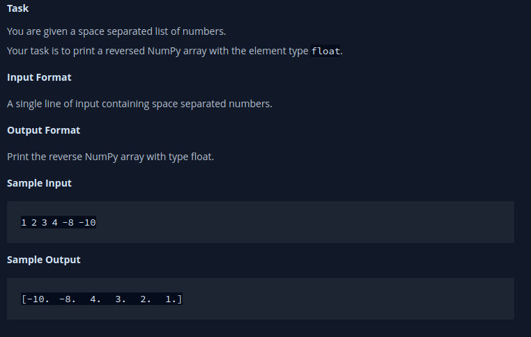

# XML

{% embed url="https://www.hackerrank.com/domains/python?badge_type=python&filters%5Bsubdomains%5D%5B%5D=xml" %}

## XML 1 - Find the Score

<figure><figcaption></figcaption></figure>

```python
import sys
import xml.etree.ElementTree as etree

def get_attr_number(node):
    count = len(node.attrib)

    for each in node:
        if len(each) > 1:
            for i in each:
                count += len(i.attrib)
        else:
            count += len(each.attrib)

    return count


if __name__ == '__main__':
    sys.stdin.readline()
    xml = sys.stdin.read()
    tree = etree.ElementTree(etree.fromstring(xml))
    root = tree.getroot()
    print(get_attr_number(root))
```

***

## XML 2 - Find the Maximum Depth

<figure><figcaption></figcaption></figure>

```python
import xml.etree.ElementTree as etree

maxdepth = 0
def depth(elem, level):
    global maxdepth

    level += 1

    if level > maxdepth:
        maxdepth = level

    for each in elem:
        depth(each, level)

if __name__ == '__main__':
    n = int(input())
    xml = ""
    for i in range(n):
        xml =  xml + input() + "\n"
    tree = etree.ElementTree(etree.fromstring(xml))
    depth(tree.getroot(), -1)
    print(maxdepth)
```
